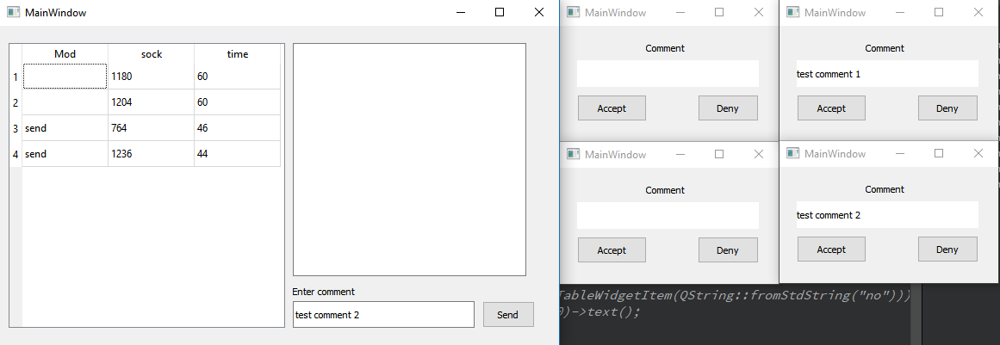
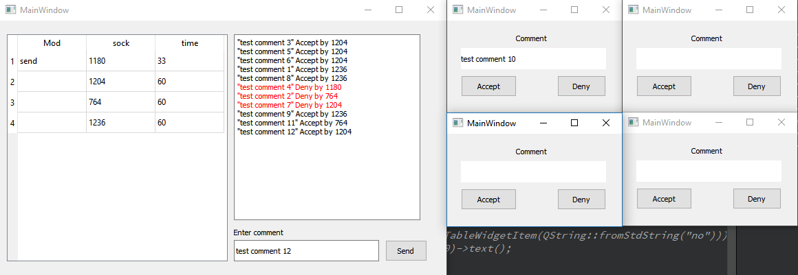
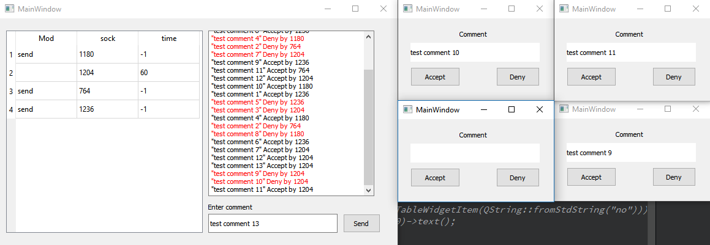

Клиент - серверное приложение. Для каждого сокета создается отдельный поток.
Задача — "Модерирование комментариев".
К серверу подключаются произвольное количество клиентов. Сервер распределяет среди клиентов комментарии, клиенты должны их проверять (Accept - принять комментарий, Deny - отклонить комментарий), и сообщить о своём решении серверу. Общение клиента и сервера происходит через сокеты. Если клиент не проверил коментарий, и не ответил серверу за 60 секунд, то он признаётся нерабочим, и его задание (коментарий) отдаётся другим работающим клиентам. Коментарии храняться в очереди последовательно (FIFO). Первый коментарий в очереди отдаётся первому освободившемуся клиенту.
